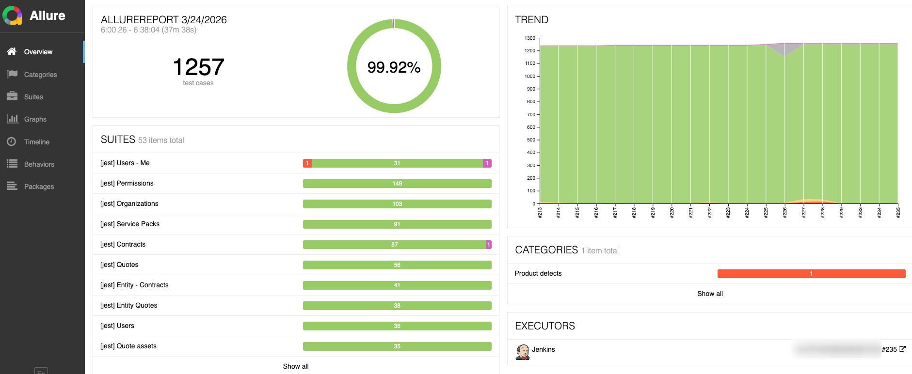
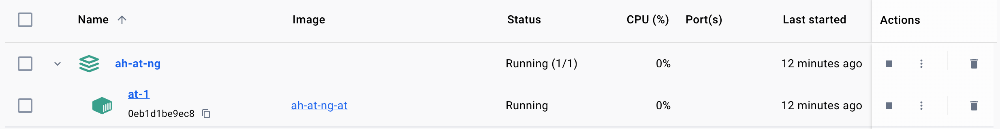
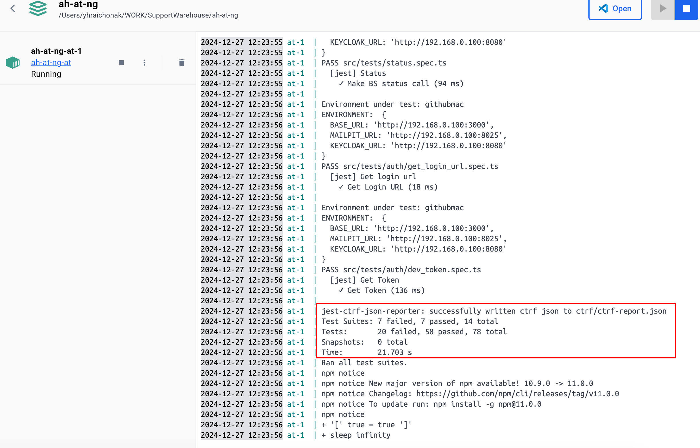

### 1. Local Test Automation execution
`npm test`

to use custom environment run:
>ENVIRONMENT=githubmac npm test
>

To use custom Jest option ([JEST CLI](https://jestjs.io/docs/cli)):
See available [environment.ts](environment.ts)
1. Run spec by file path: 
`npm test -- src/tests/metrics.spec.ts`
2. Run spec by spec name or pattern: 
`npm test -- -u -t "Make BS status call"`
3. Run spec by spec file path or pattern: 
`npm test -- -u --runTestsByPath **/metrics.spec.ts **/refresh.spec.ts`
4. Run specs subsequently (without parallelization). 
   `npm test -- -u --runInBand`
    <ins>NOTE:</ins> parallelization is not enabled by default - require isolated user per worker https://jestjs.io/docs/environment-variables 
- Results are generated in console as well as in junit.xml. To generate HTML-based Allure report execute
`npm run report`  
  

  
POCs (viTest & Playwright)

1. viTest test automation:
    >ENVIRONMENT=local vitest vitestPOC.spec.ts --reporter=json --reporter=default --reporter=html --reporter=allure-vitest/reporter
2. Playwright- JEST  test automation:
    > ENVIRONMENT=local TRACE_API_CALLS=true jest --testPathPattern=src/tests_pocs/first_test.spec.ts --roots "./src/tests_pocs"

### 2. Docker-based Test Automation execution
Docker-based infrastructure sources: 
- [docker-compose.yml](docker-compose.yml)
- [Dockerfile](Dockerfile)
- [docker_runner.sh](docker_runner.sh)

To build environment run from the project root
>ENVIRONMENT=docker docker-compose  up -d
 
 
 To run tests via Docker and not  stay alive:

`STAY_ALIVE=false ENVIRONMENT=githubmac docker compose  up -d`
`STAY_ALIVE=false TESTS="Make BS status call" FRESHDESK_AUTH=XXXXXXXXXXXXXXXXX JENKINS_AUTH=XXXXXX:XXXXXXXXXXXX ENVIRONMENT=githubmac docker compose  up -d`
`STAY_ALIVE=false ENVIRONMENT=local TESTS='User is able to login with valid credentials' MODULE='ui' docker compose  -f docker-compose.yml  up`

<ins>NOTE:</ins> make sure that specified test environment already deployed and available from local machine before test. 
run.  Results are generated in Docker console  as well as in junit.xml (of project root). To generate HTML-based Allure report execute
`npm run report`.
### 3. [<ins>AT from CICD</ins>](README_CICD.md)