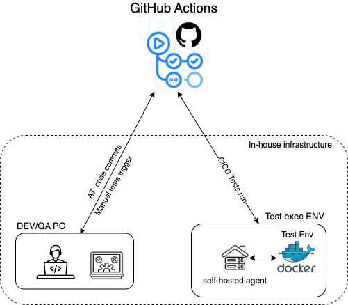
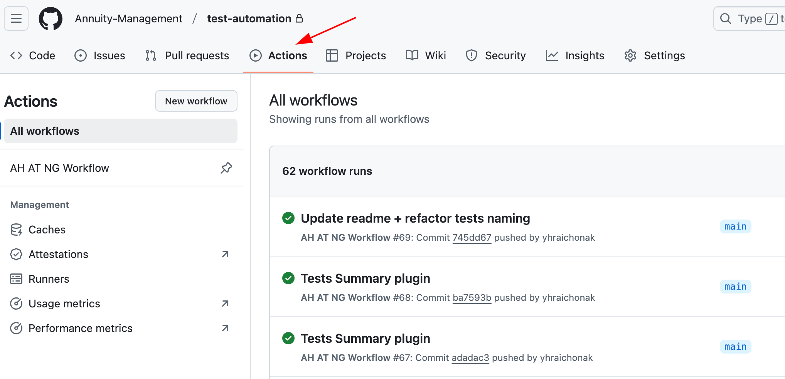
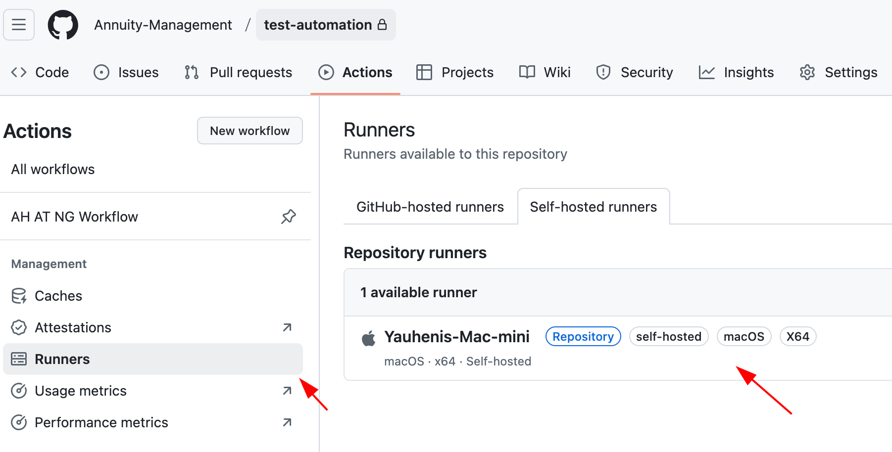
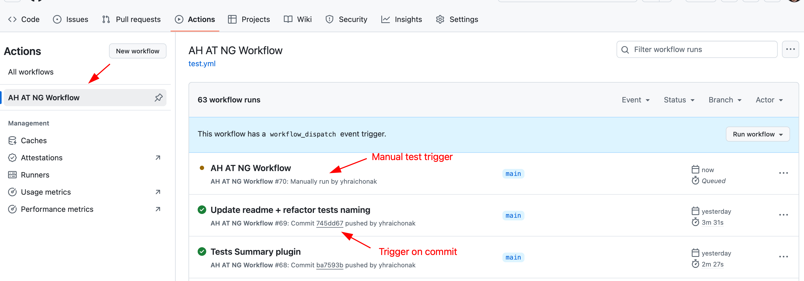
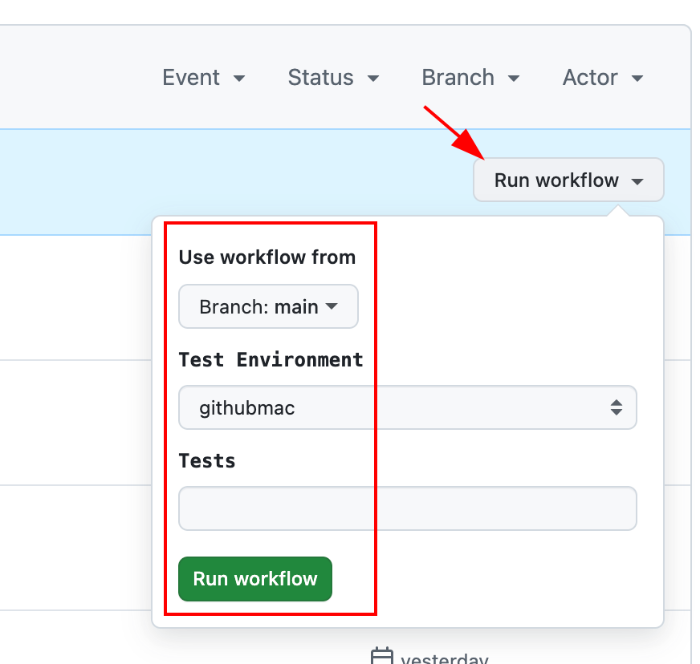
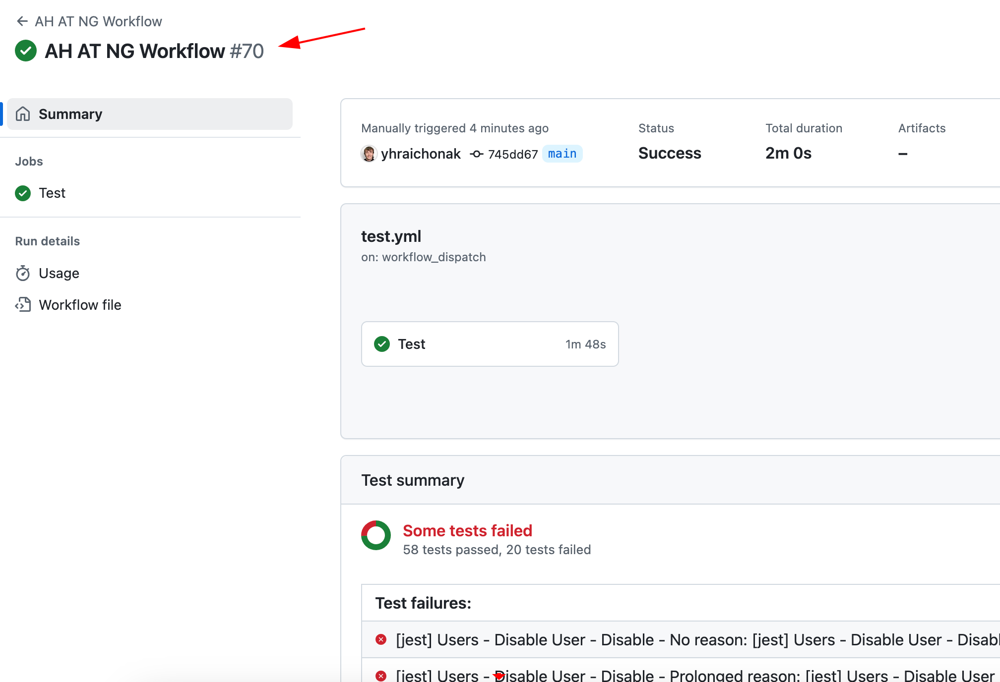
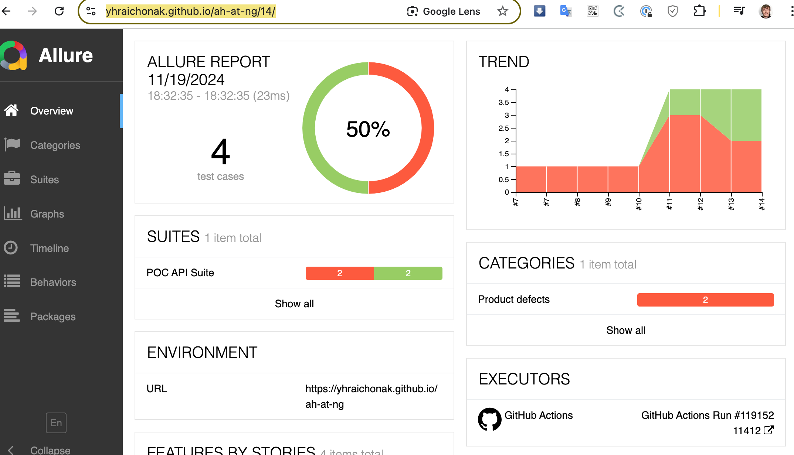

### Execution Test Automation in GutHub Actions
 
1. Integration implemented via pipeline [test.yml](.github/workflows/test.yml)
2. GitHub Actions integrated in test automation repository

   
3. Self-hosted Runner configured to run test automation against pre-deployed env. Use `ENVIRONEMNT=githubmac` while running the tests
 
4. Tests triggers:
   1. On every commit
   
   2. On demand manually by providing parameters 
   
5. Once build execution is finished  - results are available from build page. 
   
6. <ins>TODO</ins>: AllureReport publishing with test results historical trends [integration](https://allurereport.org/docs/integrations-github/#_3-set-up-publishing-to-github-pages ) (see example below). 
   https://yhraichonak.github.io/ah-at-ng/14/  
   